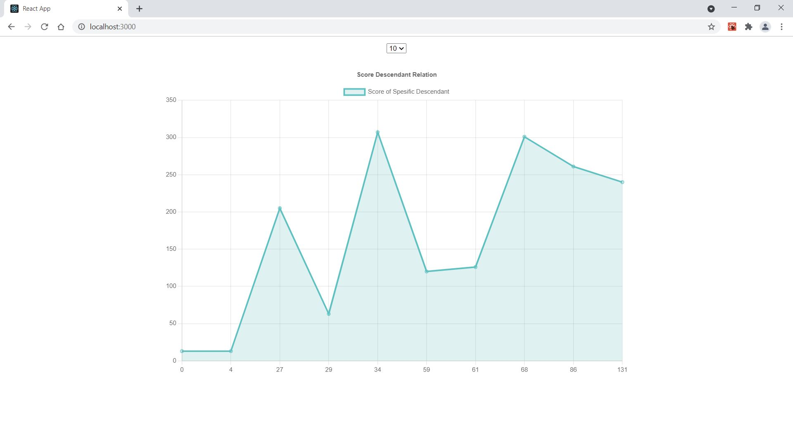
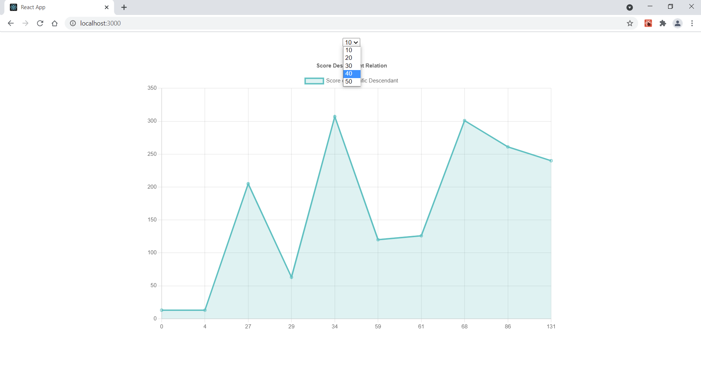
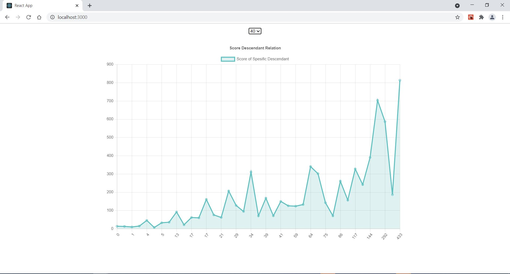

# Nielsen Assignment Project
This project has been developed by Cem Eroglu for Nielsen.

## Installing Steps
  Make sure Node.js is installed to your computer.(https://nodejs.org/en/) 
  Clone the project from my Git repository. Command: git clone https://github.com/CemEroglu/Textkernel_Assignment_Cem_Eroglu.git  
  You can also find from my Github account: https://github.com/CemEroglu  
  Change directory to the project folder: cd Textkernel_Assignment_Cem_Eroglu  
  Run " npm install " to install node_modules.  
  Run "npm start" to start the project. It will open a window on your default browser automatically. You can also view http://localhost:3000/ on your browser.  

## Overview
After setting up everything, the project should seem like below. It has an select and a graph.

## Amount of Data
You can set the amount of data to be shown.

## More Data
You can view 10 to 50 descendants based on your choice.

## Communication
You can reach me via my e-mail for anything related: cemeroglu96@gmail.com
